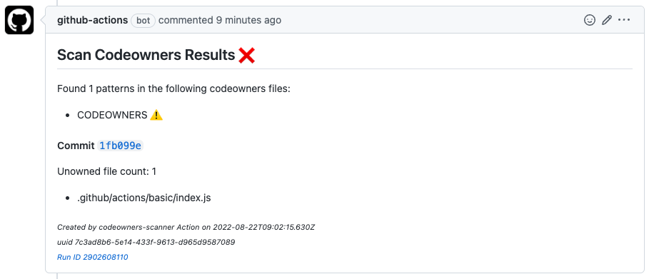

# Scan Codeowners Action

A github action that is intended to be run whenever a commit is pushed to a PR.
The action looks over the files that were modified (added or changed) and determines if there
is a codeowners pattern on the base branch that covers each file. Any files that are not covered
are considered "unowned". The action adds a comment to the PR with the results.

A sample comment looks like this:



--

This code is based off of the template https://github.com/actions/typescript-action.

# Development

When developing locally, remember to compile the changes. From the `.github/actions/scan-codeowners` directory, run:

```
npm run build && npm run package
```

Then commit and push the compiled changes.

## Code Organization

Source code for the action is in `.github/actions/scan-codeowners`.
The `src/` dir has the typescript files. The `dist/` and `lib/` dirs hold compiled code and shouldn't be edited directly.

Although there are some jest files and a `__tests__/` dir, there are no tests (yet) for this action.

## Running Locally

The `cli.ts` file is included to test the 'scan' action locally.
Run it by first exporting the required env vars (see the file itself for the list), then build to JS and run.
For example:

```
$ export GITHUB_TOKEN=xyz
$ export PR=123
$ export REPO=my-repo
$ export OWNER=my-github-name
$ npm run build && node ./lib/cli.js
```

To view extra debugging info, set the env var `DEBUG=codeowners-scan:*`.
